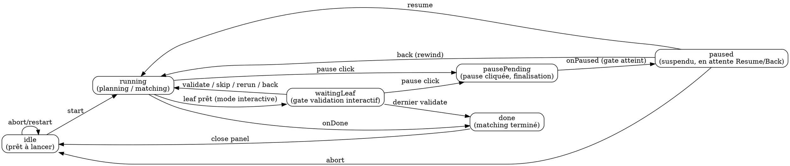

# MatchPanel — gestion d'état actuelle vs évolution vers une state machine

## Contexte

`MatchPanel` (`src/ui/MatchPanel.ts`) gère l'UI du panneau de matching guidé. Son contenu — quels boutons sont visibles, lesquels sont désactivés, quel message est affiché, quel CSS — dépend de plusieurs flags qui évoluent dans le temps :

- `phase` (store) : `no-track` → `track-loaded` → `csv-loaded` → `matching` → `done`
- `pipeline?.isRunning()` : la boucle de matching tourne
- `pipeline?.isPaused()` : la boucle est suspendue (entre lignes ou sur le burst pause gate)
- `matchingMode` : `interactive` | `burst`
- `guidedBusy` : une étape interne est en cours (loader actif)
- `pausePending` : l'utilisateur vient de cliquer Pause, on attend la finalisation
- `matchingPanelOpen` : le panneau est-il ouvert
- `guidedCollapsed`, `guidedActiveTab` : UI locale

L'orchestration est **impérative** : à chaque changement, on appelle `updateGuidedControls()` qui recalcule `setButtonVisible(...)` / `setButtonDisabled(...)` pour chaque bouton à partir de combinaisons booléennes des flags ci-dessus, plus `renderPhase()` pour la visibilité des grosses sections.

## Forces du modèle actuel

- **Direct** : pas d'abstraction supplémentaire, tout est dans le fichier.
- **Pragmatique** : ajouter un nouveau bouton = ajouter deux lignes dans `updateGuidedControls`.
- **Observabilité** : tous les flags sont sur `MatchPanel`, faciles à inspecter.

## Points de douleur observés

1. **Bugs de désynchronisation** : `stopIfRequested` émettait `onPaused` *avant* de mettre à jour `running`/`paused`, ce qui faisait que `updateGuidedControls()` lisait l'ancien état. Symptôme : Pause restait visible après pause. Cause racine : pas de garantie sur l'ordre "set-state-then-emit".
2. **Combinaisons croisées difficiles à raisonner** : `Back` doit être visible en attente interactive *ou* en pause burst, mais pas en burst running. Chaque nouvelle exigence ajoute des `&& !isDone`, `|| isPaused`, etc. Le calcul de visibilité est un OU/ET imbriqué qui croît à chaque feature.
3. **Bouton "fantôme"** : visibilité par bouton mais conteneur parent géré séparément (cas `guidedManualActionsEl.style.display = "none"` pour burst qui masquait Pause). La double couche est piège.
4. **Transitions implicites** : `Resume` callback fait `setPhase("matching")` puis `pipeline.resume()` puis `updateGuidedControls()` — l'ordre est porteur de sens mais non documenté.
5. **États mal nommés** : `phase === "csv-loaded"` est utilisé à la fois pour "CSV chargé, prêt à matcher" *et* "matching en pause" (parce que `onPaused` repasse en csv-loaded). Le flag `isPaused()` désambiguïse mais l'overload sémantique de `phase` complique la lecture.

## Une state machine simplifierait-elle ?

**Oui, pour le cœur "matching".** Pas pour tout le panneau.

Le panneau a deux niveaux :

- **Niveau "session"** (visibilité des grosses sections) : `noTrack → trackLoaded → csvLoaded → matching → done`. C'est déjà géré comme une SM linéaire via `phaseGte`. Pas besoin de changer.
- **Niveau "matching"** (boutons, messages, transitions) : c'est là que la complexité explose. Une SM explicite avec quelques états et transitions clarifierait beaucoup.

### Proposition d'états pour le sous-domaine "matching"



### Comment ça simplifie

1. **Visibilité des boutons = table par état**, plus une formule booléenne :

   | État          | Validate | Skip | Back | Pause | Resume | Close-done | Start | Restart |
   |---------------|----------|------|------|-------|--------|------------|-------|---------|
   | idle          |          |      |      |       |        |            | ✓     | ✓       |
   | running (interactif) |   |      |      |       |        |            |       | ✓       |
   | running (burst) |       |      |      | ✓     |        |            |       | ✓       |
   | waitingLeaf   | ✓        | ✓    | ✓    |       |        |            |       | ✓       |
   | pausePending  |          |      |      | ✓ (disabled) | |            |       |         |
   | paused        |          |      | ✓    |       | ✓      |            |       |         |
   | done          |          |      |      |       |        | ✓          |       |         |

   Lecture directe, plus de `&& !isDone` partout.

2. **Transitions explicites = pas de désordre set/emit** : un dispatcher `transition(event)` déplace l'état et notifie les observers. Plus de risque "j'ai oublié de mettre `running=false` avant d'émettre".

3. **Tests plus directs** : "depuis `paused`, l'événement `back` mène à `running`" → un test, indépendant des détails de rendu.

4. **Pause bug du jour disparaît par construction** : `pausePending → paused` est une transition unique ; impossible que l'UI reste sur l'état précédent.

## Évolutions proposées (ordonnées par ROI)

### Étape 1 — Extraire un type `MatchingUiState` discriminé (faible coût, gros gain)

Dans `MatchPanel`, remplacer les flags épars par :

```ts
type MatchingUiState =
  | { kind: "idle" }
  | { kind: "running"; mode: "interactive" | "burst"; busy: boolean }
  | { kind: "waitingLeaf"; leafIndex: number; leafTotal: number }
  | { kind: "pausePending" }
  | { kind: "paused"; mode: "burst" /* burst-pause-gate */ | "between-rows" }
  | { kind: "done"; rowsValidated: number; totalSegments: number };
```

`updateGuidedControls()` devient un `switch` exhaustif sur `state.kind`. TypeScript force la couverture.

**Pas d'introduction de lib SM externe** — juste du typing discipliné.

### Étape 2 — Centraliser les transitions

Un seul point d'entrée :

```ts
private dispatch(event: MatchingUiEvent): void {
  this.uiState = reduce(this.uiState, event);
  this.render();
}
```

Les events viennent de :
- callbacks utilisateur (clicks)
- événements pipeline (`onRowMatched`, `onPaused`, `onDone`, …)
- changements de store (`phase` change)

Les ordres "set-state-then-emit" deviennent une responsabilité du reducer, pas des call sites.

### Étape 3 — Aligner le pipeline sur la même grille

Le pipeline expose actuellement `isRunning()`, `isPaused()`, `getMatchedGroups()`. On pourrait remplacer par un seul `getState(): PipelineState` discriminé, et un observable `onStateChange(listener)`. La synchronisation panel ↔ pipeline devient triviale (le panel mappe `PipelineState` → `MatchingUiState`).

Cette étape est plus lourde — à faire seulement si l'étape 2 ne suffit pas.

### Étape 4 (optionnelle) — XState

Pour une vraie SM avec visualisation, `xstate` reste l'option de référence. Avantage : générer le diagramme automatiquement, vérifier les transitions impossibles à la compilation. Inconvénient : ajoute une dépendance et une learning curve. **À éviter tant que l'étape 1+2 suffit**.

## Risques de la migration

- **Régression UI silencieuse** : la table de visibilité a beaucoup de cases. Mitigation : tests E2E par état (snapshot des classes visibles/disabled par scénario).
- **Sur-ingénierie** : si le panneau ne grossit plus, l'étape 1 seule est rentable. Étape 2 paie quand on commence à empiler de nouveaux modes (e.g. mode "review" post-done).
- **Coupling avec le store** : aujourd'hui `phase` du store est lue partout. Si on déplace l'état UI ailleurs, `phase` doit rester source de vérité pour la session, pas pour l'UI matching.

## Reco

Faire l'étape 1 dès qu'on touche encore au panneau. Étape 2 si on ajoute deux nouveaux états (par ex. revue post-done, mode lecture seule). Étapes 3-4 hors-scope tant qu'on n'a pas plusieurs consommateurs du pipeline.
