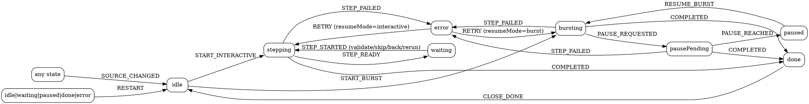

# MatchingSubTab UI State Machine Implementation Plan

> **For agentic workers:** REQUIRED SUB-SKILL: Use superpowers:subagent-driven-development (recommended) or superpowers:executing-plans to implement this plan task-by-task. Steps use checkbox (`- [ ]`) syntax for tracking.

**Goal:** Replace MatchingSubTab's five scattered matching-control flags with a discriminated `MatchingUiState` driven by a pure reducer and a single `dispatch()`, fixing four known defects by construction.

**Architecture:** A new pure module `src/ui/matchingUiState.ts` holds the state type, the event type, the reducer, and the button-visibility table — all unit-testable without DOM or WME SDK. `MatchingSubTab` keeps a single `uiState` field, routes every change through `dispatch(event)`, applies transition side effects in one place (`applyTransitionEffects`), and renders buttons from the table. The matching _progress_ state machine stays where it already is (the `Source` in `SourceStore`); this plan only formalizes the _UI control_ state. Session-level `phase` (`SessionStore`) is unchanged.

**Tech Stack:** TypeScript, vitest, i18next. No new dependencies (explicitly no XState — see `docs/match-panel-state-machine.md`).

**Defects fixed by this refactor (from the 2026-06-12 review):**

1. Review #5 — `runStep` swallows step errors with no UI feedback → new `error` state with message + Retry button.
2. Review #6 — completing matching never clears the WME segment selection → exit effect of the transition into `done`.
3. `pausePending` gap — while a burst pause is finalizing, both Pause and Resume buttons disappear → `pausePending` state shows a disabled Pause.
4. Restart/line-switch during a running burst silently continues bursting the freshly hydrated Source → `RESTART` is ignored (reducer guard) while bursting, and `SOURCE_CHANGED` forces `idle`, which the burst loop observes and exits.

**States and transitions:**



`RESTART` from `stepping`/`bursting`/`pausePending` is **ignored** (returns the same state object) — that is the race guard.

---

### Task 1: Pure reducer module

**Files:**

- Create: `src/ui/matchingUiState.ts`
- Test: `src/__tests__/matchingUiState.test.ts`

- [ ] **Step 1: Write the failing tests**

Create `src/__tests__/matchingUiState.test.ts`:

```ts
import { describe, expect, it } from "vitest";
import { reduceMatchingUi, type MatchingUiState } from "../ui/matchingUiState";

const idle: MatchingUiState = { kind: "idle" };
const stepping: MatchingUiState = { kind: "stepping" };
const waiting: MatchingUiState = { kind: "waiting" };
const bursting: MatchingUiState = { kind: "bursting" };
const pausePending: MatchingUiState = { kind: "pausePending" };
const paused: MatchingUiState = { kind: "paused" };
const errInteractive: MatchingUiState = {
  kind: "error",
  message: "boom",
  resumeMode: "interactive",
};
const errBurst: MatchingUiState = { kind: "error", message: "boom", resumeMode: "burst" };
const done: MatchingUiState = { kind: "done", rowsValidated: 3, totalSegments: 42 };

describe("reduceMatchingUi — interactive flow", () => {
  it("starts interactive from idle", () => {
    expect(reduceMatchingUi(idle, { type: "START_INTERACTIVE" })).toEqual(stepping);
  });
  it("ignores START_INTERACTIVE outside idle", () => {
    expect(reduceMatchingUi(bursting, { type: "START_INTERACTIVE" })).toBe(bursting);
  });
  it("stepping reaches the validation gate on STEP_READY", () => {
    expect(reduceMatchingUi(stepping, { type: "STEP_READY" })).toEqual(waiting);
  });
  it("STEP_READY is a no-op while bursting (burst has no gate)", () => {
    expect(reduceMatchingUi(bursting, { type: "STEP_READY" })).toBe(bursting);
  });
  it("waiting goes back to stepping on STEP_STARTED", () => {
    expect(reduceMatchingUi(waiting, { type: "STEP_STARTED" })).toEqual(stepping);
  });
});

describe("reduceMatchingUi — burst flow", () => {
  it("starts burst from idle", () => {
    expect(reduceMatchingUi(idle, { type: "START_BURST" })).toEqual(bursting);
  });
  it("pause request moves bursting to pausePending", () => {
    expect(reduceMatchingUi(bursting, { type: "PAUSE_REQUESTED" })).toEqual(pausePending);
  });
  it("PAUSE_REQUESTED is a no-op outside bursting", () => {
    expect(reduceMatchingUi(waiting, { type: "PAUSE_REQUESTED" })).toBe(waiting);
  });
  it("pause is reached only from pausePending", () => {
    expect(reduceMatchingUi(pausePending, { type: "PAUSE_REACHED" })).toEqual(paused);
    expect(reduceMatchingUi(bursting, { type: "PAUSE_REACHED" })).toBe(bursting);
  });
  it("resume returns paused to bursting", () => {
    expect(reduceMatchingUi(paused, { type: "RESUME_BURST" })).toEqual(bursting);
  });
});

describe("reduceMatchingUi — error and retry", () => {
  it("a failed interactive step lands in error with resumeMode interactive", () => {
    expect(reduceMatchingUi(stepping, { type: "STEP_FAILED", message: "boom" })).toEqual(
      errInteractive,
    );
  });
  it("a failed burst step lands in error with resumeMode burst (also from pausePending)", () => {
    expect(reduceMatchingUi(bursting, { type: "STEP_FAILED", message: "boom" })).toEqual(errBurst);
    expect(reduceMatchingUi(pausePending, { type: "STEP_FAILED", message: "boom" })).toEqual(
      errBurst,
    );
  });
  it("retry resumes in the mode that failed", () => {
    expect(reduceMatchingUi(errInteractive, { type: "RETRY" })).toEqual(stepping);
    expect(reduceMatchingUi(errBurst, { type: "RETRY" })).toEqual(bursting);
  });
  it("RETRY is a no-op outside error", () => {
    expect(reduceMatchingUi(waiting, { type: "RETRY" })).toBe(waiting);
  });
});

describe("reduceMatchingUi — completion, restart, source change", () => {
  it("COMPLETED carries the summary from stepping, bursting and pausePending", () => {
    const ev = { type: "COMPLETED", rowsValidated: 3, totalSegments: 42 } as const;
    expect(reduceMatchingUi(stepping, ev)).toEqual(done);
    expect(reduceMatchingUi(bursting, ev)).toEqual(done);
    expect(reduceMatchingUi(pausePending, ev)).toEqual(done);
  });
  it("CLOSE_DONE returns done to idle", () => {
    expect(reduceMatchingUi(done, { type: "CLOSE_DONE" })).toEqual(idle);
  });
  it("RESTART works from idle, waiting, paused, done and error", () => {
    for (const s of [idle, waiting, paused, done, errBurst]) {
      expect(reduceMatchingUi(s, { type: "RESTART" })).toEqual(idle);
    }
  });
  it("RESTART is IGNORED while stepping, bursting or pausePending (race guard)", () => {
    for (const s of [stepping, bursting, pausePending]) {
      expect(reduceMatchingUi(s, { type: "RESTART" })).toBe(s);
    }
  });
  it("SOURCE_CHANGED forces idle from any state", () => {
    for (const s of [idle, stepping, waiting, bursting, pausePending, paused, errBurst, done]) {
      expect(reduceMatchingUi(s, { type: "SOURCE_CHANGED" })).toEqual(idle);
    }
  });
});
```

- [ ] **Step 2: Run the tests to verify they fail**

Run: `npx vitest run src/__tests__/matchingUiState.test.ts`
Expected: FAIL — `Cannot find module '../ui/matchingUiState'`.

- [ ] **Step 3: Implement the module**

Create `src/ui/matchingUiState.ts`:

```ts
export type MatchingMode = "interactive" | "burst";

export type MatchingUiState =
  | { kind: "idle" }
  | { kind: "stepping" } // interactive step in flight
  | { kind: "waiting" } // interactive validation gate
  | { kind: "bursting" } // burst loop running
  | { kind: "pausePending" } // pause requested, current step finishing
  | { kind: "paused" } // burst suspended
  | { kind: "error"; message: string; resumeMode: MatchingMode }
  | { kind: "done"; rowsValidated: number; totalSegments: number };

export type MatchingUiEvent =
  | { type: "START_INTERACTIVE" }
  | { type: "START_BURST" }
  | { type: "STEP_STARTED" }
  | { type: "STEP_READY" }
  | { type: "STEP_FAILED"; message: string }
  | { type: "PAUSE_REQUESTED" }
  | { type: "PAUSE_REACHED" }
  | { type: "RESUME_BURST" }
  | { type: "RETRY" }
  | { type: "COMPLETED"; rowsValidated: number; totalSegments: number }
  | { type: "RESTART" }
  | { type: "CLOSE_DONE" }
  | { type: "SOURCE_CHANGED" };

/**
 * Pure transition function. Illegal (state, event) pairs return the SAME state
 * object so callers can use referential equality to detect "nothing happened".
 */
export function reduceMatchingUi(state: MatchingUiState, event: MatchingUiEvent): MatchingUiState {
  switch (event.type) {
    case "SOURCE_CHANGED":
      return { kind: "idle" };
    case "START_INTERACTIVE":
      return state.kind === "idle" ? { kind: "stepping" } : state;
    case "START_BURST":
      return state.kind === "idle" ? { kind: "bursting" } : state;
    case "STEP_STARTED":
      return state.kind === "waiting" ? { kind: "stepping" } : state;
    case "STEP_READY":
      return state.kind === "stepping" ? { kind: "waiting" } : state;
    case "STEP_FAILED":
      if (state.kind === "stepping") {
        return { kind: "error", message: event.message, resumeMode: "interactive" };
      }
      if (state.kind === "bursting" || state.kind === "pausePending") {
        return { kind: "error", message: event.message, resumeMode: "burst" };
      }
      return state;
    case "PAUSE_REQUESTED":
      return state.kind === "bursting" ? { kind: "pausePending" } : state;
    case "PAUSE_REACHED":
      return state.kind === "pausePending" ? { kind: "paused" } : state;
    case "RESUME_BURST":
      return state.kind === "paused" ? { kind: "bursting" } : state;
    case "RETRY":
      if (state.kind !== "error") return state;
      return state.resumeMode === "burst" ? { kind: "bursting" } : { kind: "stepping" };
    case "COMPLETED":
      if (state.kind === "stepping" || state.kind === "bursting" || state.kind === "pausePending") {
        return {
          kind: "done",
          rowsValidated: event.rowsValidated,
          totalSegments: event.totalSegments,
        };
      }
      return state;
    case "RESTART":
      if (
        state.kind === "idle" ||
        state.kind === "waiting" ||
        state.kind === "paused" ||
        state.kind === "done" ||
        state.kind === "error"
      ) {
        return { kind: "idle" };
      }
      return state; // race guard: never restart under a running loop/step
    case "CLOSE_DONE":
      return state.kind === "done" ? { kind: "idle" } : state;
  }
}
```

- [ ] **Step 4: Run the tests to verify they pass**

Run: `npx vitest run src/__tests__/matchingUiState.test.ts`
Expected: PASS (all tests).

- [ ] **Step 5: Commit**

```bash
git add src/ui/matchingUiState.ts src/__tests__/matchingUiState.test.ts
git commit -m "feat(matching): pure MatchingUiState reducer for the guided panel"
```

---

### Task 2: Button-visibility table and status key

**Files:**

- Modify: `src/ui/matchingUiState.ts` (append)
- Test: `src/__tests__/matchingUiState.test.ts` (append)

- [ ] **Step 1: Write the failing tests**

Append to `src/__tests__/matchingUiState.test.ts`:

```ts
import { controlsFor, statusKeyFor } from "../ui/matchingUiState";

describe("controlsFor", () => {
  it("idle with a source shows Start, Start burst and Restart only", () => {
    const c = controlsFor({ kind: "idle" }, true);
    expect(c.start).toEqual({ visible: true, enabled: true });
    expect(c.startBurst).toEqual({ visible: true, enabled: true });
    expect(c.restart).toEqual({ visible: true, enabled: true });
    expect(c.validate.visible).toBe(false);
    expect(c.pause.visible).toBe(false);
    expect(c.doneClose.visible).toBe(false);
  });
  it("idle without a source hides everything", () => {
    const c = controlsFor({ kind: "idle" }, false);
    for (const v of Object.values(c)) expect(v.visible).toBe(false);
  });
  it("waiting enables the per-sub-line controls", () => {
    const c = controlsFor({ kind: "waiting" }, true);
    for (const key of ["validate", "skip", "back", "reselect", "rerun"] as const) {
      expect(c[key]).toEqual({ visible: true, enabled: true });
    }
    expect(c.start.visible).toBe(false);
  });
  it("stepping shows the per-sub-line controls disabled", () => {
    const c = controlsFor({ kind: "stepping" }, true);
    for (const key of ["validate", "skip", "back", "reselect", "rerun"] as const) {
      expect(c[key]).toEqual({ visible: true, enabled: false });
    }
  });
  it("bursting shows an enabled Pause; pausePending shows it DISABLED (feedback gap fix)", () => {
    expect(controlsFor({ kind: "bursting" }, true).pause).toEqual({
      visible: true,
      enabled: true,
    });
    expect(controlsFor({ kind: "pausePending" }, true).pause).toEqual({
      visible: true,
      enabled: false,
    });
    expect(controlsFor({ kind: "pausePending" }, true).resume.visible).toBe(false);
  });
  it("paused shows Resume and Restart", () => {
    const c = controlsFor({ kind: "paused" }, true);
    expect(c.resume).toEqual({ visible: true, enabled: true });
    expect(c.restart).toEqual({ visible: true, enabled: true });
    expect(c.pause.visible).toBe(false);
  });
  it("error shows Retry and Restart", () => {
    const c = controlsFor({ kind: "error", message: "x", resumeMode: "burst" }, true);
    expect(c.retry).toEqual({ visible: true, enabled: true });
    expect(c.restart).toEqual({ visible: true, enabled: true });
  });
  it("done shows only Close", () => {
    const c = controlsFor({ kind: "done", rowsValidated: 1, totalSegments: 2 }, true);
    expect(c.doneClose).toEqual({ visible: true, enabled: true });
    expect(c.restart.visible).toBe(false);
  });
  it("restart is visible but disabled while a loop or step runs (race guard echo)", () => {
    for (const kind of ["stepping", "bursting", "pausePending"] as const) {
      expect(controlsFor({ kind }, true).restart).toEqual({ visible: true, enabled: false });
    }
  });
});

describe("statusKeyFor", () => {
  it("maps every state to a panelStatus i18n key", () => {
    expect(statusKeyFor({ kind: "idle" })).toBe("ready");
    expect(statusKeyFor({ kind: "stepping" })).toBe("running");
    expect(statusKeyFor({ kind: "bursting" })).toBe("running");
    expect(statusKeyFor({ kind: "waiting" })).toBe("waiting");
    expect(statusKeyFor({ kind: "pausePending" })).toBe("paused");
    expect(statusKeyFor({ kind: "paused" })).toBe("paused");
    expect(statusKeyFor({ kind: "error", message: "x", resumeMode: "burst" })).toBe("error");
    expect(statusKeyFor({ kind: "done", rowsValidated: 1, totalSegments: 2 })).toBe("done");
  });
});
```

- [ ] **Step 2: Run the tests to verify they fail**

Run: `npx vitest run src/__tests__/matchingUiState.test.ts`
Expected: FAIL — `controlsFor` is not exported.

- [ ] **Step 3: Implement the table**

Append to `src/ui/matchingUiState.ts`:

```ts
export interface ButtonView {
  visible: boolean;
  enabled: boolean;
}

export interface MatchingControlsView {
  start: ButtonView;
  startBurst: ButtonView;
  validate: ButtonView;
  skip: ButtonView;
  back: ButtonView;
  reselect: ButtonView;
  rerun: ButtonView;
  pause: ButtonView;
  resume: ButtonView;
  retry: ButtonView;
  doneClose: ButtonView;
  restart: ButtonView;
}

const HIDDEN: ButtonView = { visible: false, enabled: false };
const SHOWN: ButtonView = { visible: true, enabled: true };
const SHOWN_DISABLED: ButtonView = { visible: true, enabled: false };

const ALL_HIDDEN: MatchingControlsView = {
  start: HIDDEN,
  startBurst: HIDDEN,
  validate: HIDDEN,
  skip: HIDDEN,
  back: HIDDEN,
  reselect: HIDDEN,
  rerun: HIDDEN,
  pause: HIDDEN,
  resume: HIDDEN,
  retry: HIDDEN,
  doneClose: HIDDEN,
  restart: HIDDEN,
};

/** One row per state — the whole "which button when" question, in one place. */
export function controlsFor(state: MatchingUiState, hasSource: boolean): MatchingControlsView {
  switch (state.kind) {
    case "idle":
      if (!hasSource) return ALL_HIDDEN;
      return { ...ALL_HIDDEN, start: SHOWN, startBurst: SHOWN, restart: SHOWN };
    case "stepping":
      return {
        ...ALL_HIDDEN,
        validate: SHOWN_DISABLED,
        skip: SHOWN_DISABLED,
        back: SHOWN_DISABLED,
        reselect: SHOWN_DISABLED,
        rerun: SHOWN_DISABLED,
        restart: SHOWN_DISABLED,
      };
    case "waiting":
      return {
        ...ALL_HIDDEN,
        validate: SHOWN,
        skip: SHOWN,
        back: SHOWN,
        reselect: SHOWN,
        rerun: SHOWN,
        restart: SHOWN,
      };
    case "bursting":
      return { ...ALL_HIDDEN, pause: SHOWN, restart: SHOWN_DISABLED };
    case "pausePending":
      return { ...ALL_HIDDEN, pause: SHOWN_DISABLED, restart: SHOWN_DISABLED };
    case "paused":
      return { ...ALL_HIDDEN, resume: SHOWN, restart: SHOWN };
    case "error":
      return { ...ALL_HIDDEN, retry: SHOWN, restart: SHOWN };
    case "done":
      return { ...ALL_HIDDEN, doneClose: SHOWN };
  }
}

export type PanelStatusKey = "ready" | "running" | "waiting" | "paused" | "error" | "done";

export function statusKeyFor(state: MatchingUiState): PanelStatusKey {
  switch (state.kind) {
    case "idle":
      return "ready";
    case "stepping":
    case "bursting":
      return "running";
    case "waiting":
      return "waiting";
    case "pausePending":
    case "paused":
      return "paused";
    case "error":
      return "error";
    case "done":
      return "done";
  }
}
```

- [ ] **Step 4: Run the tests to verify they pass**

Run: `npx vitest run src/__tests__/matchingUiState.test.ts`
Expected: PASS.

- [ ] **Step 5: Commit**

```bash
git add src/ui/matchingUiState.ts src/__tests__/matchingUiState.test.ts
git commit -m "feat(matching): controls table and status key per MatchingUiState"
```

---

### Task 3: New locale keys

**Files:**

- Modify: `locales/en/common.json`
- Modify: `locales/fr/common.json`

- [ ] **Step 1: Add the English keys**

In `locales/en/common.json`, inside `panel.matching.panelStatus` (it already has `ready`, `running`, `waiting`, `done`), add:

```json
"paused": "Paused",
"error": "Error"
```

Inside `panel.matching` add:

```json
"retry": "Retry",
"stepError": "Matching step failed: {{message}}",
"burstStalled": "Automatic matching stalled: the last step produced no sub-line to validate."
```

- [ ] **Step 2: Add the French keys**

In `locales/fr/common.json`, same locations:

```json
"paused": "En pause",
"error": "Erreur"
```

```json
"retry": "Réessayer",
"stepError": "Échec de l'étape de matching : {{message}}",
"burstStalled": "Le matching automatique s'est arrêté : la dernière étape n'a produit aucune sous-ligne à valider."
```

- [ ] **Step 3: Verify JSON validity and commit**

Run: `npx tsc --noEmit` (only the pre-existing `waitForMapIdle.test.ts` error is acceptable) and `node -e "JSON.parse(require('fs').readFileSync('locales/en/common.json','utf8')); JSON.parse(require('fs').readFileSync('locales/fr/common.json','utf8')); console.log('ok')"`
Expected: `ok`.

```bash
git add locales/en/common.json locales/fr/common.json
git commit -m "feat(i18n): paused/error panel statuses, retry and step-error messages"
```

---

### Task 4: Integrate the state machine into MatchingSubTab

This is one coherent rewrite committed once (intermediate flag/state hybrids would not compile cleanly). All edits are in `src/ui/subtabs/MatchingSubTab.ts`. Line numbers are approximate — anchor on method names.

**Files:**

- Modify: `src/ui/subtabs/MatchingSubTab.ts`

- [ ] **Step 1: Replace the flag fields with one state field**

Delete the fields `guidedBusy`, `matchingActive`, `matchingMode`, `burstPaused`, `burstRunning` (~lines 101-131). Add:

```ts
private uiState: MatchingUiState = { kind: "idle" };
private guidedRetryBtn: HTMLElement | null = null;
```

Import at the top of the file:

```ts
import {
  controlsFor,
  reduceMatchingUi,
  statusKeyFor,
  type ButtonView,
  type MatchingUiEvent,
  type MatchingUiState,
} from "../matchingUiState";
```

- [ ] **Step 2: Add dispatch and transition effects**

Add next to `updateGuidedControls()`:

```ts
private dispatch(event: MatchingUiEvent): void {
  const prev = this.uiState;
  const next = reduceMatchingUi(prev, event);
  if (next === prev) return;
  this.uiState = next;
  this.applyTransitionEffects(prev, next);
  this.updateGuidedControls();
}

/** Side effects owned by transitions — the single place set-state-then-act is ordered. */
private applyTransitionEffects(prev: MatchingUiState, next: MatchingUiState): void {
  if (next.kind === "done" && prev.kind !== "done") {
    this.store.setPhase("done");
    if (this.guidedSegmentCountEl) {
      this.guidedSegmentCountEl.textContent = i18next.t("panel.matching.steps.completedSummary", {
        rowsValidated: next.rowsValidated,
        totalSegments: next.totalSegments,
      });
    }
    this.trackLayer?.setHighlightedSlice(null);
    // Review finding #6: return the operator to a clean map view.
    try {
      this.wmeSDK.Editing.setSelection({ selection: { ids: [], objectType: "segment" } });
    } catch (err) {
      logger.warn("MatchingSubTab: clearing selection on done failed", err);
    }
  }
  if (next.kind === "error" && this.guidedInstructionEl) {
    // Review finding #5: surface step failures to the operator.
    this.guidedInstructionEl.textContent = i18next.t("panel.matching.stepError", {
      message: next.message,
    });
  }
}
```

- [ ] **Step 3: Rewrite updateGuidedControls from the table**

Replace the whole body of `updateGuidedControls()` (~lines 1429-1472) with:

```ts
private updateGuidedControls(): void {
  const hasSource = this.sourceStore.getSource() !== null;
  const c = controlsFor(this.uiState, hasSource);
  this.applyButtonView(this.guidedStartBtn, c.start);
  this.applyButtonView(this.guidedStartBurstBtn, c.startBurst);
  this.applyButtonView(this.guidedValidateBtn, c.validate);
  this.applyButtonView(this.guidedSkipBtn, c.skip);
  this.applyButtonView(this.guidedBackBtn, c.back);
  this.applyButtonView(this.guidedReselectBtn, c.reselect);
  this.applyButtonView(this.guidedRerunBtn, c.rerun);
  this.applyButtonView(this.guidedPauseBtn, c.pause);
  this.applyButtonView(this.guidedResumeBtn, c.resume);
  this.applyButtonView(this.guidedRetryBtn, c.retry);
  this.applyButtonView(this.guidedDoneCloseBtn, c.doneClose);
  this.applyButtonView(this.guidedRestartBtn, c.restart);
  if (this.guidedStatusEl) {
    this.guidedStatusEl.textContent = i18next.t(
      `panel.matching.panelStatus.${statusKeyFor(this.uiState)}`,
    );
  }
}

private applyButtonView(button: HTMLElement | null, view: ButtonView): void {
  this.setButtonVisible(button, view.visible);
  this.setButtonDisabled(button, !view.enabled);
}
```

- [ ] **Step 4: Rewire the start / interactive handlers**

Replace `onStartMatchingClick`, `onValidateClick`, `onSkipMatchingClick`, `onBackMatchingClick`, `onRerunCurrentRowClick` (~lines 1201-1301):

```ts
private async onStartMatchingClick(): Promise<void> {
  if (this.uiState.kind !== "idle") return;
  const pipeline = this.ensurePipeline();
  if (!pipeline) return;
  this.matchingPanelOpen = true;
  this.store.setPhase("matching");
  if (this.guidedInstructionEl) {
    this.guidedInstructionEl.textContent = i18next.t("panel.matching.validateOrCorrect");
  }
  this.dispatch({ type: "START_INTERACTIVE" });
  await this.runStep(() => pipeline.stepUntilValidation());
}

private async onValidateClick(): Promise<void> {
  if (this.uiState.kind !== "waiting") return;
  const pipeline = this.lazyPipeline;
  if (!pipeline) return;
  pipeline.validate(resolveValidationIds(this.readSelectionSegmentIds()));
  this.dispatch({ type: "STEP_STARTED" });
  await this.runStep(() => pipeline.stepUntilValidation());
}

private async onSkipMatchingClick(): Promise<void> {
  if (this.uiState.kind !== "waiting") return;
  const pipeline = this.lazyPipeline;
  if (!pipeline) return;
  pipeline.validate([]);
  this.dispatch({ type: "STEP_STARTED" });
  await this.runStep(() => pipeline.stepUntilValidation());
}

private async onBackMatchingClick(): Promise<void> {
  if (this.uiState.kind !== "waiting") return;
  const pipeline = this.lazyPipeline;
  if (!pipeline) return;
  pipeline.back();
  this.dispatch({ type: "STEP_STARTED" });
  await this.runStep(() => pipeline.stepUntilValidation());
}

private async onRerunCurrentRowClick(): Promise<void> {
  if (this.uiState.kind !== "waiting") return;
  const pipeline = this.lazyPipeline;
  if (!pipeline) return;
  pipeline.rerunCurrent();
  this.dispatch({ type: "STEP_STARTED" });
  await this.runStep(() => pipeline.stepUntilValidation());
}
```

- [ ] **Step 5: Rewire runStep around the reducer**

Replace `runStep` (~lines 1304-1330):

```ts
/** Run a pipeline step; outcome transitions (ready/failed/completed) go through dispatch. */
private async runStep(step: () => Promise<void>): Promise<void> {
  this.setGuidedLoading(true, i18next.t("panel.matching.matchingInProgress"));
  try {
    await step();
  } catch (err) {
    logger.error("MatchingSubTab.runStep: pipeline step failed", err);
    this.dispatch({
      type: "STEP_FAILED",
      message: err instanceof Error ? err.message : String(err),
    });
    return;
  } finally {
    this.setGuidedLoading(false);
  }
  if (this.isSourceComplete()) {
    this.dispatch({
      type: "COMPLETED",
      rowsValidated: this.countValidatedSubLines(),
      totalSegments: this.countMatchedSegments(),
    });
    return;
  }
  this.renderSourceState();
  this.dispatch({ type: "STEP_READY" }); // no-op while bursting (no gate in burst mode)
}
```

- [ ] **Step 6: Rewire the burst loop, pause and resume**

Replace `onStartBurstClick`, `onResumeBurstClick`, `runBurstLoop` (~lines 1216-1268), and the Pause button's `onClick` (~line 853, currently `this.burstPaused = true`):

```ts
private async onStartBurstClick(): Promise<void> {
  if (this.uiState.kind !== "idle") return;
  const pipeline = this.ensurePipeline();
  if (!pipeline) return;
  this.matchingPanelOpen = true;
  this.store.setPhase("matching");
  if (this.guidedInstructionEl) {
    this.guidedInstructionEl.textContent = i18next.t("panel.matching.burstRunning");
  }
  this.dispatch({ type: "START_BURST" });
  await this.runBurstLoop(pipeline);
}

private async onResumeBurstClick(): Promise<void> {
  if (this.uiState.kind !== "paused") return;
  const pipeline = this.lazyPipeline;
  if (!pipeline) return;
  this.store.setPhase("matching");
  this.dispatch({ type: "RESUME_BURST" });
  await this.runBurstLoop(pipeline);
}

/**
 * Step + auto-validate while the machine stays in `bursting`. Pause, error,
 * completion and source switches all leave that state, which exits the loop —
 * no boolean loop flags.
 */
private async runBurstLoop(pipeline: LazyMatchingPipeline): Promise<void> {
  while (this.uiState.kind === "bursting") {
    await this.runStep(() => pipeline.stepUntilValidation());
    if (this.uiState.kind !== "bursting" && this.uiState.kind !== "pausePending") return;
    const src = this.sourceStore.getSource();
    const cursor = src?.cursor;
    const sub =
      cursor && src ? src.lines[cursor.lineIndex]?.subLines[cursor.subLineIndex] : undefined;
    if (!sub || sub.validated) {
      // The step produced nothing actionable: surface it instead of silently stopping.
      this.dispatch({ type: "STEP_FAILED", message: i18next.t("panel.matching.burstStalled") });
      return;
    }
    pipeline.validate();
    if (this.uiState.kind === "pausePending") {
      this.dispatch({ type: "PAUSE_REACHED" });
      return;
    }
  }
}
```

Pause button wiring (in the guided panel builder, ~line 850):

```ts
this.guidedPauseBtn = this.appendGuidedButton(matchActions, {
  text: i18next.t("panel.matching.pause"),
  variant: "secondary",
  onClick: () => {
    this.dispatch({ type: "PAUSE_REQUESTED" });
  },
});
this.guidedPauseBtn.classList.add("wmegj-guided-button--pause");
```

- [ ] **Step 7: Add the Retry button**

In the guided panel builder, right after the Resume button block (~line 866), add:

```ts
this.guidedRetryBtn = this.appendGuidedButton(matchActions, {
  text: i18next.t("panel.matching.retry"),
  variant: "primary",
  onClick: () => {
    void this.onRetryClick();
  },
});
this.guidedRetryBtn.classList.add("wmegj-guided-button--retry");
```

Add the handler next to `onResumeBurstClick`:

```ts
private async onRetryClick(): Promise<void> {
  if (this.uiState.kind !== "error") return;
  const pipeline = this.lazyPipeline;
  if (!pipeline) return;
  const mode = this.uiState.resumeMode;
  this.dispatch({ type: "RETRY" });
  if (mode === "burst") {
    await this.runBurstLoop(pipeline);
  } else {
    await this.runStep(() => pipeline.stepUntilValidation());
  }
}
```

Also reset `this.guidedRetryBtn = null;` in the teardown block where `guidedPauseBtn`/`guidedResumeBtn` are nulled (~line 426).

- [ ] **Step 8: Dispatch SOURCE_CHANGED / RESTART / CLOSE_DONE at the remaining sites**

1. In `onSelectedLineChangedAsync` right after `this.sourceStore.hydrate(source)` (~line 290): `this.dispatch({ type: "SOURCE_CHANGED" });`
2. In `rebuildSourceWithCsv` (~lines 605-621): delete the lines `this.matchingActive = false; this.burstRunning = false; this.burstPaused = false;` and add `this.dispatch({ type: "SOURCE_CHANGED" });` after `this.sourceStore.hydrate(source)`.
3. In `onRestartFromScratchClick` (~lines 1402-1427): at the top of the confirmed branch add `if (this.uiState.kind === "stepping" || this.uiState.kind === "bursting" || this.uiState.kind === "pausePending") return;` (belt-and-braces — the button is already disabled in those states). Delete the flag resets (`this.matchingActive = false; this.matchingMode = "interactive"; this.burstRunning = false; this.burstPaused = false;`) and add `this.dispatch({ type: "RESTART" });` before `this.sourceStore.hydrate(fresh)`, which itself is followed by `this.dispatch({ type: "SOURCE_CHANGED" });`.
4. In `closeMatchingPanel()` add `this.dispatch({ type: "CLOSE_DONE" });` as the first line.
5. Grep for every remaining reference to the deleted flags (`guidedBusy`, `matchingActive`, `matchingMode`, `burstRunning`, `burstPaused`) — including `resetGuidedSessionState` — and replace each read with the equivalent `this.uiState.kind` check (e.g. `guidedBusy` → `this.uiState.kind === "stepping"`; `matchingActive` → `kind` is one of `stepping|waiting|bursting|pausePending|paused`). There must be zero references left.

- [ ] **Step 9: Compile and run the suite**

Run: `npx tsc --noEmit`
Expected: only the pre-existing `waitForMapIdle.test.ts` error.
Run: `npx vitest run`
Expected: all tests pass (the reducer/table tests from Tasks 1-2 plus the existing 340+).

- [ ] **Step 10: Commit**

```bash
git add src/ui/subtabs/MatchingSubTab.ts
git commit -m "refactor(matching): drive the guided panel through MatchingUiState dispatch"
```

---

### Task 5: Manual smoke test in WME + docs update

**Files:**

- Modify: `docs/match-panel-state-machine.md` (status note)

- [ ] **Step 1: Build and load the userscript**

Run the project's usual build (`npm run build` — check package.json scripts) and load the script in WME (Tampermonkey). Smoke checklist:

1. Interactive: Start → step presents a sub-line → Validate ×2 → Back re-presents the previous sub-line → finish a small track → "done" shows summary AND the WME selection is cleared.
2. Burst: Start burst → Pause mid-run → Pause button stays visible but greyed until the step finishes → Resume → run to done.
3. Error: temporarily throw inside `stepUntilValidation` (devtools breakpoint or a one-line local patch) → panel shows the error message and a Retry button; Retry resumes in the same mode.
4. Race guard: during a burst run, verify Restart is greyed; switch the selected line mid-burst → the loop stops (panel back to idle for the new line).

- [ ] **Step 2: Update the design doc status**

Append to `docs/match-panel-state-machine.md`:

```markdown
## Statut (2026-06-12)

Étapes 1+2 implémentées dans `MatchingSubTab` via `src/ui/matchingUiState.ts`
(reducer pur + table de visibilité + `dispatch`). États : idle, stepping,
waiting, bursting, pausePending, paused, error, done. Étapes 3 (pipeline
`getState()`) et 4 (XState) restent hors-scope. La machine de _progression_
vit dans `SourceStore` (Source.cursor/validated/pendingTail), pas ici.
```

- [ ] **Step 3: Commit**

```bash
git add docs/match-panel-state-machine.md
git commit -m "docs: record MatchingUiState implementation status"
```

---

## Self-review notes

- **Spec coverage:** finding #5 → Task 4 steps 2/5/7 (error state, STEP_FAILED, Retry); finding #6 → Task 4 step 2 (clear selection on done); pausePending gap → Task 2 table + Task 4 step 6; restart race → Task 1 reducer guard + Task 4 step 8.3; line-switch race → SOURCE_CHANGED + loop condition (Task 4 steps 6/8.1).
- **Type consistency:** `MatchingUiState`/`MatchingUiEvent`/`controlsFor`/`statusKeyFor`/`ButtonView` defined in Tasks 1-2 and imported with those exact names in Task 4 step 1. `resolveValidationIds` already exists in MatchingSubTab.ts (review fix #2). `appendGuidedButton({ text, variant, onClick })` matches the existing builder pattern.
- **Known scope cuts (YAGNI):** no `hasProgress` payload on idle (the resume banner keeps its existing wiring); no Back button while paused (current behavior preserved); `matchingPanelOpen`/`guidedCollapsed` stay as plain local UI fields.
